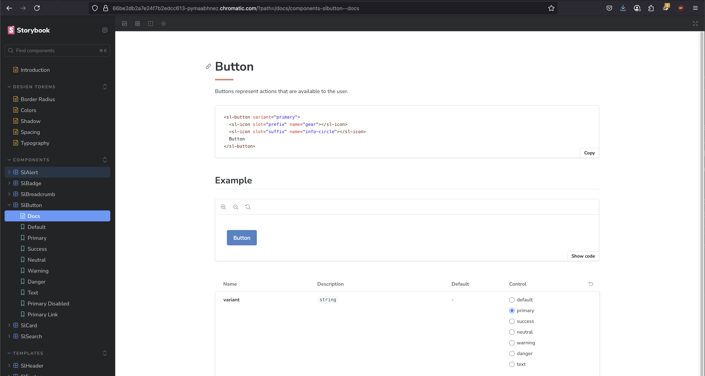

# Design System

Example [Storybook](https://storybook.js.org/)[Storybook](https://storybook.js.org/) that with standard web components in vanilla JavaScript. While this example is not complete, it can serve as a starting point for your projects.

I am building this to stay up to date with Storybook and Web Components. I am also using this as a reference for my future projects.

[//]: # (TODO: Replace photo.)


## Running the project

### Clone the repository

First, clone the repository from GitHub to your local machine:

```bash
git clone https://github.com/klarence/designsystem
```

### Install the dependencies

Navigate to the project directory and install the necessary dependencies using npm:

```bash
cd designsystem
npm install
```

### Run Storybook

[Storybook](https://storybook.js.org/) is an environment for creating UI components and pages in isolation. It is used for UI development, testing, and documentation. It is open source and free.

To start Storybook and view your components, use the following command:

```bash
npm run storybook
```

This will launch Storybook at `http://localhost:6006` by default, where you can browse and test your components in an isolated environment.

### Compile the solution

To build the solution for production, use the following command:

```bash
npm run build
```

This command will create a `dist` folder at the root of the project. Inside, you will find JavaScript files, CSS styles, and optimized images ready to be integrated into your project.

### Start the development environment (optional)

The development environment ([vite.js](https://vitejs.dev/)) allows you to do integration tests on a standard web page. See the `index.html` file (uses uncompiled javascript and css), and the `example.html` file (uses compiled javascript and css from the `dist` folder)

To start the development environment, use the following command:

```bash
npm run dev
```

## License
I am not really sure which license is required since I leveraged other people's repos with their own licenses. 
I will go with the [licence MIT](https://opensource.org/license/MIT).

## Authors

[@klarence](https://github.com/klarence)

I was having a hard time figuring out how to set up a Vanilla JS Storybook with Vite, so I leveraged  https://github.com/bourpie/designsystem, Thank you, [@bourpie](https://github.com/bourpie)!

Also, a big THANK YOU to existing vanilla JS Web Component Libraries that I leverage(/plan to).
https://icons.getbootstrap.com/
https://github.com/shoelace-style/shoelace
https://github.com/GoogleChromeLabs/howto-components/


References:
https://material-web.dev/about/intro/
https://getuikit.com/
https://franken-ui.dev/
https://picocss.com/
https://bulma.io/